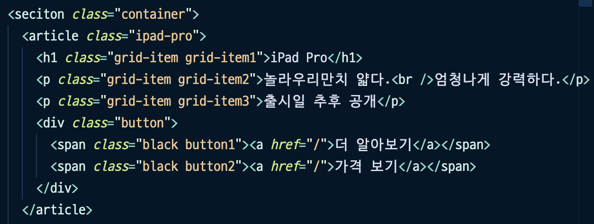
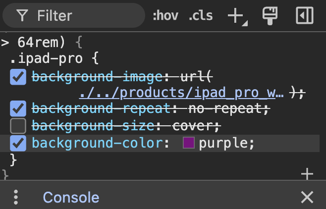

# Html에 대한 설명

1. 선생님이 주신 애플은 컨텐츠 부분이기 대문에 section으로 묶은 후 각 각 article로 묶었습니다

2. 그 후 큰 제목을 h1을 사용했습니다. h1번은 중복으로 사용 할 수 없지만 의미가 있는 section이나 article과 같은 컨텐츠라면 중복으로 사용할 수 있다고 알고 있습니다.

3. p태그를 사용하여 상품에 대한 설명을 적었습니다. 출시일 후 공개는 내용들과 다른 의미 인것 같아 다른 p태그를 다시 선언후 묶어보았습니다.

4.span과 a태그를 이용하여 이동하기 버튼을 만들었습니다. 하지만 예상과 달리 문구들과 버튼이 같이 정렬되지 않아 div를 이용하여 버튼만 묶어보았습니다만 이것이 맞는지는 모르겠습니다.

---

# CSS에 대한 설명

1. 선생님이 주신 전체적인 size와 padding 그리고 margin값을 먼저 정리 한뒤 클래스 속성에 맞춰서 속성값을 넣었습니다.

2. p태그의 폰트 두께가 얇은 것 같아 600으로 변경하였습니다.

3. columns값을 1로 주었습니다. 화면이 점점 커지는 것을 대비하여 2열 4열도 해보았지만 이미지 크기를 벗어나면 더이상 커지지 않고 글씨만 2열 가운데로 커져서 1열을 주었습니다. 제 의도되로 되진 않아 적절하지 않았다고 생각합니다.

4. 백그라운드 이미지가 반복되어 no-repeat을 주었고 이미지 크기가 화면이 작아지면 유동적이지 않게 고정이되어 작아지는 만큼 사진이 잘리기에 contain값을 주어 지정한 요소 안에 배경 이미지가 다 들어오도록 이미지를 넣었습니다.

5. 이미지의 비율을 맞추기 위에 aspect-ratio를 1/1주어었는데 이미지가 너무 커져서 auto를 주었습니다.

# 질문

왜 이미지가 화면을 늘리는대로 커지지 않나요? aspect-ratio를 사용하면 할 수 있을거 같지만 어떤 원리인지 찾아봐도 잘 모르겠습니다(1 / 1로 주면 너무 커집니다.)

2. 왜 열을 주었을때 span2를 주어도 이미지가 안늘어날까요? (이미지 사이즈보다 확대하고 싶은데 아무리해도 되질 않습니다.)background-color에서는 잘 늘어났었는데 안되는 이유가 궁금합니다

3. 1024px보다 작은 경우 container쿼리를 inline-size < 1024px이런 식으로는 못사용 하나요?

4. 컨테이너 쿼리를 사용했음에도 배경색상은 잘 나오는데 이미지가 바뀌질 않습니다. 제가 무엇을 잘못했는지 모르겠습니다...
   

5. flex를 사용하지 않고 글자들을 가운데 정렬하는 방법을 모르겠습니다. inline-size를 주면 유동적으로 바뀌지 않는 이유가 궁금합니다. (position을 사용하면 이미지들이 이상하게 보입니다. 이것은 마크업의 문제인것 같습니다.)

6. 밀도에 따라 이미지를 바꾸고 싶어서 찾아보았지만 srcset에 대한 설명밖에 없었습니다. srcset외에 어떻게 이미지를 바꿀 수 있나요?
